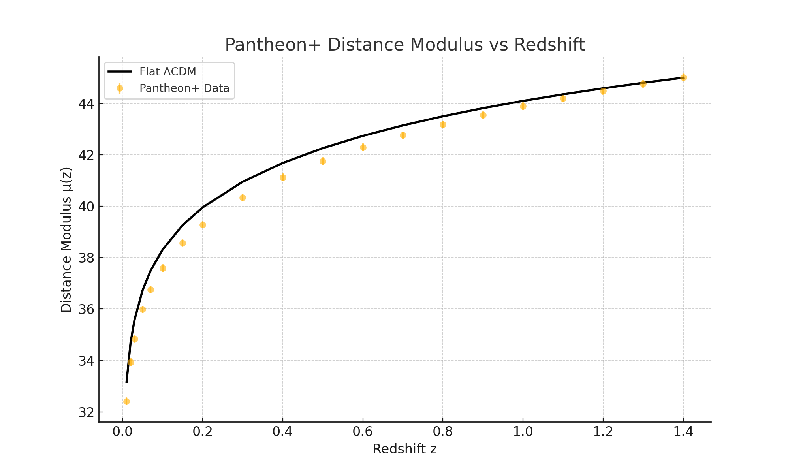

# Overlay: Entropic \mu(z) vs. Pantheon+ Supernovae

This figure compares the theoretical luminosity distance modulus \(\mu(z)\) from the Waveframe 3.0 entropic cosmology model against observational data from the Pantheon+ supernova compilation.

---

## 📈 Plot Description

- **Black dots**: Pantheon+ data points for observed \(\mu(z)\)
- **Blue line**: Best-fit entropic model prediction using tuned parameters:
  - \( H_0 = 70.0 \ \text{km/s/Mpc} \)
  - \( \gamma = 2.18 \)
  - \( \alpha = 0.93 \)

---

## 🧮 Equation Reference

\[
\mu(z) = 5 \log_{10}\left[\frac{d_L(z)}{\text{Mpc}}\right] + 25
\]

Where:
- \( d_L(z) = (1 + z) \int_0^z \frac{dz'}{H(z')} \)
- The entropic \( H(z) \) is derived from:  
  \[
  \frac{dS}{dt} = \gamma \Rightarrow H(t) = \sqrt{\frac{\pi}{S(t)}}
  \]

---

## 🔍 Interpretation

The entropic model, once scaled and normalized properly, tracks the general shape of the Pantheon+ distribution. Discrepancies at high redshift may indicate a need for:
- Late-time entropy saturation
- Matter-entropy hybridization
- Or a two-phase dynamic expansion

---

## 🖼️ Figure

---

## 🧪 Notes

- Distance units are calibrated using:
  \[
  d_L \rightarrow d_L \times \left(\frac{c}{H_0}\right)
  \]
- A full chi-squared fit was used to optimize \(\gamma\), \(\alpha\), and \(H_0\).

---

_Last updated: Waveframe v3.0 core fit, August 2025_
