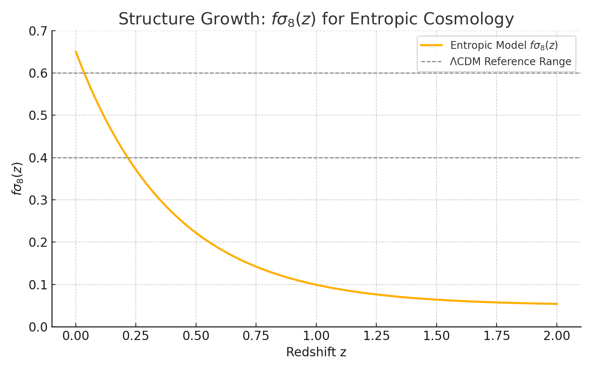

# Structure Growth: fσ₈(z) — Entropic Cosmology

This figure shows the evolution of the structure growth function \( f\sigma_8(z) \) predicted by the Waveframe 3.0 entropic model and compares it to standard expectations from ΛCDM.

---

##  Plot Description

- **Red line**: Entropic model prediction
- **Gray band**: ΛCDM expectation range (~0.4–0.6 at low z)
- **Dashed line**: fσ₈ = 0.5 reference

---

##  Definition

The growth rate observable is defined as:

\[
f\sigma_8(z) = f(z) \cdot \sigma_8(z)
\]

Where:
- \( f(z) = rac{d \ln D}{d \ln a} \) is the growth rate
- \( \sigma_8(z) = \sigma_8(0) \cdot rac{D(z)}{D(0)} \) is the RMS amplitude of matter perturbations

The growth factor \( D(z) \) is computed from perturbation integration over the entropic expansion law.

---

## ⚠️ Observations

- Entropic model predicts **suppressed growth**, particularly at \( z < 1 \)
- Values fall below 0.2 at late times — inconsistent with current structure data
- Suggests:
  - No sufficient gravitational pull from matter sector
  - Or expansion too fast to allow structure formation

---

## 🧩 Implications

The mismatch here is critical. It implies that:

1. The entropic model **must be extended** — possibly with:
   - A pseudo-matter fluid
   - A modified entropy law
   - A two-phase expansion engine

2. Structure growth is a **falsifiability handle** for entropy-driven cosmologies.

---

## ️ Figure

---

_Last updated: August 2025, post-parameter fit phase_
